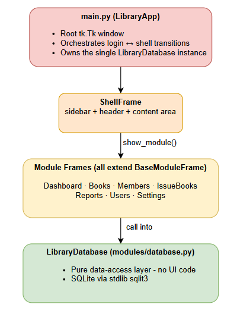
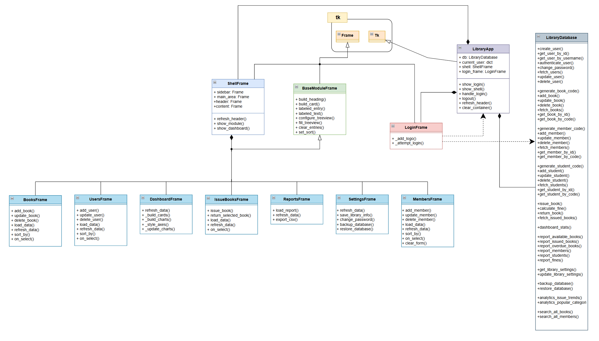
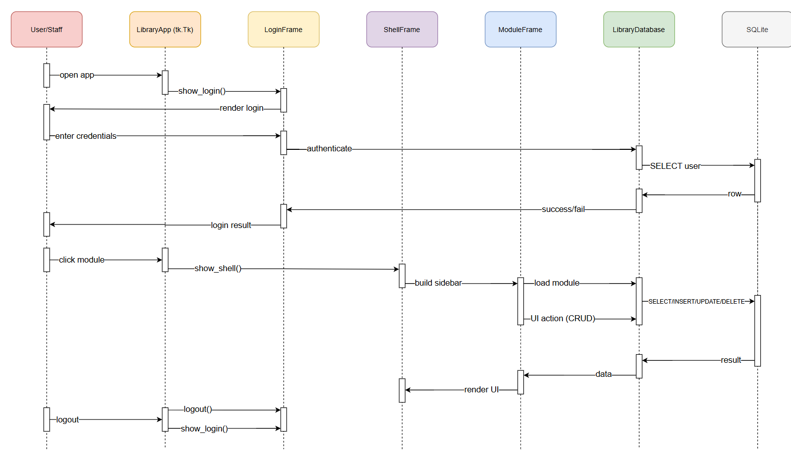
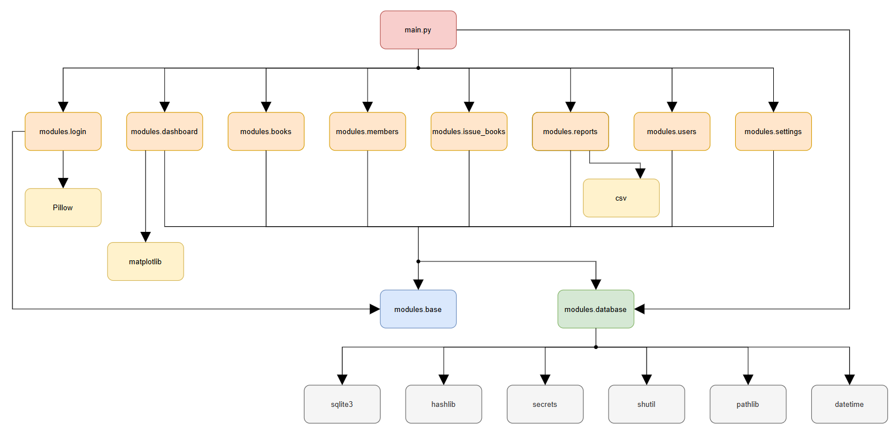

# Code Comprehension Report

## 1. High-Level Architecture

The system is a single-process, fully offline desktop application built on 
 

**Python 3 / Tkinter / SQLite3**.

	

 

**Layers:**

| Layer | Responsibility |
|---|---|
| `main.py` | Application bootstrap, window lifecycle, routing |
| `modules/base.py` | Shared constants (COLORS, FONTS) and reusable widget helpers |
| `modules/*.py` (UI) | One Tkinter Frame per domain, each self-contained |
| `modules/database.py` | All SQL logic; returns plain `dict` objects to the UI |

---

## 2. Class Diagram

	

---

## 3. Sequence Diagram 

	

---

## 4. Dependency Graph

	

---
